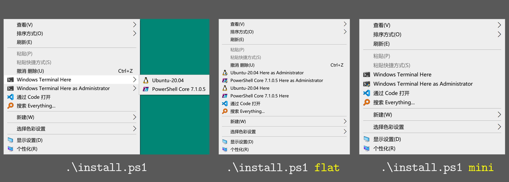

# 用于 Windows 终端的安装/卸载上下文菜单项的 PowerShell 脚本

*A project backed by [LeXtudio Inc.](https://www.lextudio.com)*

## 1. 安装指南

1. [安装 Windows Terminal](https://github.com/microsoft/terminal).
2. [安装 PowerShell 7](https://docs.microsoft.com/en-us/powershell/scripting/install/installing-powershell-core-on-windows?view=powershell-7).
3. 以**管理员身份**启动 PowerShell 7 控制台 (Powershell 5 是**不行**的)，然后运行 `src` 目录下的 `install.ps1` 脚本，将【上下文菜单项】安装到 Windows 资源管理器。现在，菜单项已添加到 Windows 资源管理器上下文菜单了。

> **图 1**: 三种安装方式，注意，一定要在**管理员模式**下安装，切记！(个人比较喜欢 `mini` 模式)

## 2. 安装示例

1. 以管理员身份打开刚安装好的 Powershell Core 7，然后切换工作目录到本库
2. 确保网络畅通；
3. 执行 `install.ps1 mini`，然后你将获得一个**类似图 1 中的第二幅图**的桌面、文件夹右键菜单。

> 如果只运行 `install.ps1` 而不加参数，那么菜单项将以 `default` 布局组织。 其他布局（如 `mini` 和 `flat`）具有不同的外观。 要应用其他布局（如 `flat`），只需运行 `install.ps1 flat`。

## 3. 卸载

以管理员身份，在 PowerShell Core 7 中，执行 `uninstall.ps1 [mini | flat]` 即可删除该配置。

## 4. 注意

- 当前版本仅支持 Windows 10；
- `install.ps1` 和 `uninstall.ps1` 脚本**必须**以管理员身份运行；
- `install.ps1` 和 `uninstall.ps1` 仅操作上下文菜单项的 Windows 资源管理器设置，而不写入 Windows 终端设置；
- 从 GitHub 下载 Windows Terminal 图标 (在 `install.ps1` 中) 需要 Internet 连接，最好在运行 `install.ps1` 时，将代理软件设置为全局代理；
